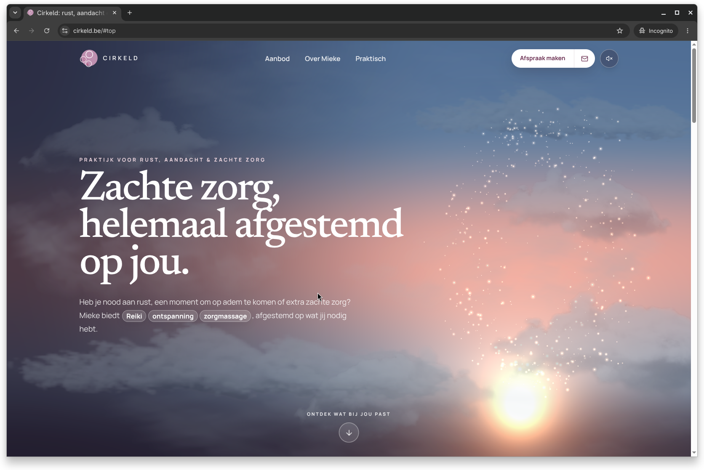

import cloudTexture from "./cloud-cumulus.webp";
import { Image } from "astro:assets";

I wanted a Three.js background that added atmosphere without competing with the content. It needed to feel like a quiet space: light slowly shifting, clouds hanging at different distances, and a small current of energy responding as you move through the content.



**See the finished experience: [cirkeld.be](https://www.cirkeld.be/)**

The result is one fixed [Three.js](https://threejs.org/) canvas behind the content. It is more like a tiny, art-directed atmosphere than a conventional hero animation. The whole implementation was generated with Codex and shaped through visual iteration.

## The brief: a background with a purpose

Before writing shaders, I set a few constraints for the background:

- It needed to change its lighting as visitors scroll, moving from a warm evening through night and into morning.
- The central particle flow had to suggest Reiki energy: gentle, luminous and alive, not a generic sci-fi vortex.
- That flow should begin as two offset currents beside the hero copy, then morph into a circular form later in the page.
- Clouds needed real depth, with the energy sometimes passing behind them and sometimes in front.
- It had to remain decorative: legible content first, reduced motion support, and a lighter path for mobile devices.

Those requirements led to a small Three.js scene with three layers: a procedural sky, transparent cloud planes, and two particle currents driven by the same custom shaders.

## A sky that follows the page

The base is a full-screen shader, not a sky texture. It blends a few vertical colour stops between dusk, night and morning, with soft sun glows and a little breathing light.

Each page section provides a point on that timeline. As the centre of the viewport moves down the page, the scene smoothly interpolates to the next phase. This lets the atmosphere evolve with the content instead of restarting an animation in every section.

At its simplest, the scroll code turns the page position into a phase between `0` and `1` and passes it to all three systems:

```ts
const probe = window.scrollY + window.innerHeight * 0.5;
const progress = smoothstep((probe - start.position) / distance);
const phase = start.phase + (end.phase - start.phase) * progress;

sky.update(seconds, phase);
clouds.update(seconds, pointer.x, pointer.y, phase);
energy.update(
  seconds,
  deltaSeconds,
  pointer.x,
  pointer.y,
  pointer.strength,
  phase,
);
```

The sky shader uses that shared value to blend between its dusk, night and day palettes:

```glsl
float toNight = smoothstep(0.02, 0.48, uPhase);
float toDay = smoothstep(0.5, 1.0, uPhase);

vec3 topColor = mix(mix(sunsetTop, nightTop, toNight), dayTop, toDay);
vec3 horizonColor = mix(mix(sunsetHorizon, nightHorizon, toNight), dayHorizon, toDay);
```

## Clouds as a 2.5D layer cake

The clouds are transparent WebP cut-outs placed on ten planes at different depths. Every plane has its own scale, crop, mirrored direction, opacity, drift speed and pointer parallax. Small differences like those are what keep the scene from reading as the same cloud strip repeated over and over.

<figure class="not-prose my-10 overflow-hidden rounded-2xl bg-slate-900 p-6 md:p-10">
  <Image
    src={cloudTexture}
    width={cloudTexture.width}
    height={cloudTexture.height}
    alt="A transparent cumulus cloud texture before shader lighting"
    loading="lazy"
    class="mx-auto max-h-[28rem] w-full object-contain"
  />
  <figcaption class="mt-4 text-center text-sm text-slate-300">
    One of the transparent source textures before shader lighting.
  </figcaption>
</figure>

I authored each plane in normalised screen coordinates, then converted that placement to world space for the current camera. A cloud definition is intentionally just art-direction data:

```ts
addCloud({
  texture: silhouetteTexture,
  ndc: [0.58, -0.05],
  z: -12,
  widthFraction: 0.49,
  opacity: 0.31,
  parallax: 0.64,
  travel: 3.1,
  speed: -0.22,
  renderOrder: 5.8,
});
```

The cloud shader does the rest. It samples the original image, uses its luminance to separate the body from the shadow, and detects the soft alpha edges as vapour. Depending on the scroll phase, it adds a warmer lower edge at sunset, cools the shadows at night, and brings in a subtle silver lining at dawn.

The essential part is small. Luminance shapes the cloud body, while alpha identifies the soft vapour edge:

```glsl
float luminance = dot(cloud.rgb, vec3(0.2126, 0.7152, 0.0722));
float bodyLight = smoothstep(0.12, 0.96, luminance);
float vaporEdge = 1.0 - smoothstep(0.2, 0.88, cloud.a);

vec3 color = mix(shadowColor, lightColor, bodyLight);
color += lightColor * vaporEdge * silverLining;
color = mix(color, uWarmColor, goldenLight);
```

The important bit is that the clouds are not just decorative layers. One cloud deliberately sits between the two particle currents: it hides the rear current, while the front current still glows over it. That single render-order choice makes the energy appear to weave through the sky rather than float on top of it.

```ts
backCurrent.renderOrder = 4.65;
crossingCloud.renderOrder = 5.8;
frontCurrent.renderOrder = 6.15;
```

## The custom particle shader: two currents of Reiki energy

The glowing form is built from two point clouds moving in opposite directions. I use it as a visual interpretation of Reiki energy: soft, circular and responsive. Each particle gets a deterministic set of attributes at creation time: angle, radius, depth, speed, size, phase, tone and brightness. The actual positions are calculated in the vertex shader, so the browser only has to update a small set of uniforms every frame.

*I am not spiritual myself, but I can put myself in that mindset. Calm, attentive and embodied movement became the design constraint instead of trying to make Reiki literal.*

The particles normally follow a gently breathing ellipse. Near the top of the page, the pair of currents sits to the side; further down, it morphs into a centred circle. I also added a little imperfection in the shader so the orbit never feels mechanically perfect.

The core of that morph is only a blend between the ellipse and a circular radius:

```glsl
float streamRadiusX = (1.9 + aRadius * 0.82) * breath;
float streamRadiusY = (3.42 + aRadius * 0.72) * breath;
float circularRadius = (2.62 + aRadius * 0.77) * breath;

float radiusX = mix(streamRadiusX, circularRadius, uCenterMorph);
float radiusY = mix(streamRadiusY, circularRadius, uCenterMorph);
vec3 transformed = vec3(
  cos(theta) * radiusX + uStreamOffset * (1.0 - uCenterMorph),
  sin(theta) * radiusY,
  (aDepth - 0.5) * 1.8
);
```

An `IntersectionObserver` changes the target when a later content section enters the viewport. The `uCenterMorph` uniform is damped towards that target, so the form changes gradually instead of snapping into a circle.

Pointer interaction stays deliberately local. The cursor and a smoothed cursor trail push nearby particles outward, lift them forward and brighten them. In the fragment shader, `gl_PointCoord` turns every point into a soft halo, a core and a tiny reflected highlight. Pearl, gold and a hint of blush become cooler at night and catch warm glints near the shader's sun field.

## Atmosphere without the weight

The effect is there to support the reading experience, so it has to know when to step back.

- On standard hardware, each current contains 280 particles. Smaller or lower-memory devices use 120 per current, smaller cloud assets, no antialiasing and simpler texture filtering.
- The renderer uses a pixel ratio of `1` and caps the loop at 60 frames per second, avoiding a large GPU cost on high-density displays.
- With `prefers-reduced-motion`, it renders a stable frame instead of running the journey and pointer interaction.
- The canvas is loaded after the page can already paint, pauses in background tabs, and disposes its GPU resources when the page goes away.

That balance was the real goal: something with depth and a little magic, but never something that competes with the words or drains the visitor's battery.

## Why this became practical now

I had used Three.js before, so I knew the fundamentals, but I would not normally have proposed this amount of bespoke WebGL for a small project. Building, tuning and maintaining layered assets, custom shaders, responsive composition, scroll state and graceful fallbacks would previously have taken too long.

Codex changed that calculation. I could describe the visual intention, inspect the result, and iterate on the details: the energy shape, which cloud should cross it, when the sky should warm up, and how the low-power version should behave. The code was generated with AI, while the brief, art direction and judgement stayed with me. Three.js in the age of AI really does feel like a gift.

The main lessons I would carry into another scene are:

- Use one shared phase to make separate visual systems feel connected.
- Create depth with deliberate layering before reaching for heavier 3D geometry.
- Decide on the performance and reduced-motion paths while designing the effect, not afterwards.

If you want to see how those choices feel together, [open the finished scene](https://www.cirkeld.be/) and scroll through it.
